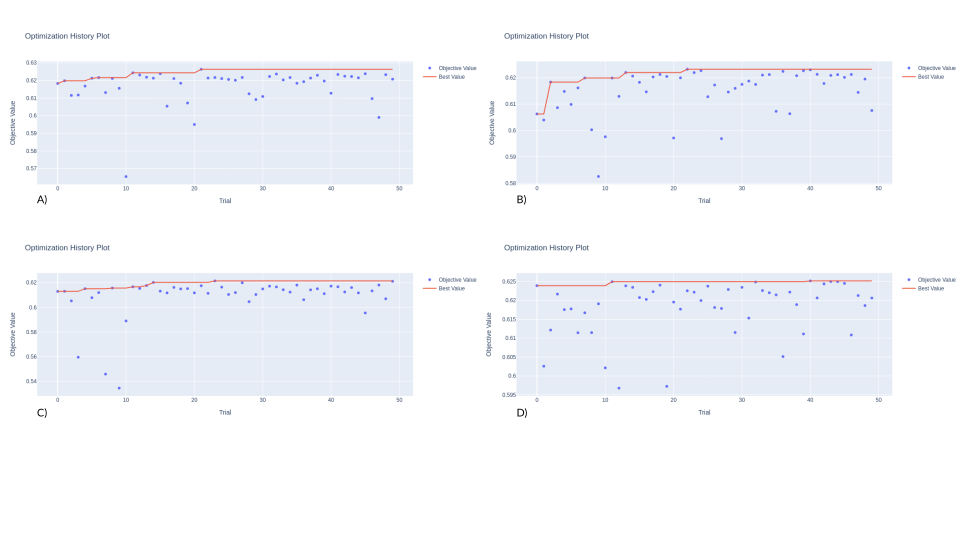

# Recommender system API

## Purpose and objectives

### Purpose

* Creating a web API for recommending text posts to users using content-based approach.

### Objectives

* Collect and prepare training data
* Conduct EDA and train baseline model
* Create a pipeline for the entire model training process:

    1. Data loading and preprocessing
    2. Extraction text features from post content
    3. Selection of hyperparameters (HP) for chosen model
    4. Retraining model using all the data
    5. Saving the fitted model, features and HP selection history

* Based on saved models and saved data, create endpoint for post recommendations
* Create an A/B testing system to compare different models

## Results

<figure>

<figcaption align = "center"><b>Fig. 1 - Optimization history. A) TF-IDF, B) RoBERTa, C) BERT, D) DistilBERT.</b></figcaption>
</figure>

<figure>

<figcaption align = "center"><b>Fig. 2 - Hyperparameter importance. A) TF-IDF, B) RoBERTa, C) BERT, D) DistilBERT.</b></figcaption>
</figure>


## Data description

As raw data, I used the following tables:

### user_data

| Field name  | Overview  |
|---|---|
| age  | User age (in profile)  |
| city  | User city (in profile)  |
| country  | User country (in profile)  |
| exp_group  | Experimental group: some encrypted category  |
| gender  | User Gender  |
| id  | Unique user ID  |
| os | The operating system of the device from which the social network is used  |
| source  | Whether the user came to the app from organic traffic or from ads  |

### post_text_df

| Field name | Overview |
|---|---|
| id  | Unique post ID  |
| text  | Text content of the post  |
| topic  | Main theme |

### feed_data

| Field name  | Overview  |
|---|---|
| timestamp  | The time the viewing was made  |
| user_id | id of the user who viewed the post |
| post_id  | viewed post id  |
| action  | Action Type: View or Like  |
| target  | Views have 1 if a like was made almost immediately after viewing, otherwise 0. Like actions have a missing value.  |

In the `recommender_system/data` directory you can find the full `posts_info` and `user_info` tables as well as the small peace of `feed_data`. Also tables with extracted text features can be found in this directory (e.g. `posts_info_bert` means that text features were extracted using `BERT` model).

## Workflow overview

### EDA and baseline model training

`CatBoost` with `TF-IDF` text extraction features method was used as the baseline model. The detailed exploratory data analysis as well as baseline model training can be found [here](recommender_system/training_pipeline/eda_and_baseline.ipynb).

### Training pipeline

An important part of the training pipeline is its settings in `recommender_system/training_pipeline_config.yaml`. Here you can specify the source of data, text feature extraction method, and so on. For example, if `pg_connection` is empty, then `local_data_storage` will be used as the data source.

```
pg_connection:
local_data_storage: ../data
```

The training pipeline includes:

1. Data loading
2. Text features extraction
3. Creating training and validation datasets
4. HP selection of `CatBoost` using `Optuna`
5. Retraining the model using all data
6. Saving results in `training_results` directory

### Web API

Web API is simple endpoint that accepts *user_id* and *time* as request parameters and returns specified number of recommendations, including *post_id*, *topic* and *text*. Depending on the group the user is in (control or test), the different models will be used for recommendations.

Example response:

```
{
    "exp_group": "test", # This information will be used for A/B tests
    "recommendations": [
        {
            "id": 4376,
            "text": "Despite its age, this film retains its 
            undoubted charm and attraction, and is a fine, surviving 
            example of early British cinema. It has an underlying 
            air of eeriness, interspersed with shafts of humour 
            which are not out of place, and serve to demonstrate the 
            assured direction & production values involved. So many 
            episodic type films are disjointed and untidy, but this 
            is not one of them. The standard of acting helps a great 
            deal, and the various disparate characters come across 
            as interesting and believable. All in all, this 
            long-forgotten little gem is well worth anyones 
            attention, in spite of the one jarring note in the film 
            which, surprisingly, escaped the censors attention!",
            "topic": "movie"
        },
        ...
```

Web API settings can be found in `recommender_system/web_api/web_api_config.yaml`.

### A/B test results analysis

#### Results:

* A/B test was conducted
* Analysis of its results showed that the metric improved significantly

The detailed report in `jupyter notebook` can be found [here](/recommender_system/ab_test_results_analysis/ab_test_result_analysis.ipynb).

## Usage

All code was run on **python 3.9.7** on **Ubuntu 22.04** and **Ubuntu 20.04**. Correct work on other vesrions is not guaranteed.

There are several options for working:

* Run training pipeline locally
* Run web service locally
* Run web service locally in docker container

### Training pipeline

You need `git` to be installed. Open terminal (`Crtl+Alt+t`) and run following commands:

```
git clone git@github.com:danon6868/recommender-system-api.git
cd recommender-system-api
python -m venv venv
source venv/bin/activate
pip install -r requirements.txt
```

Then your can configure the training pipeline in `recommender_system/training_pipeline_config.yaml`. After all, you can run it:

```
cd recommender_system/training_pipeline/
python training_pipeline.py
```

At the end you will have a saved model and history of HP optimization in `recommender_system/training_pipeline/training_results` directory.

### Web service

Your don't need `pytorch`, `transformers` and other heavy libraries, so you should use another file with requirements.

```
git clone git@github.com:danon6868/recommender-system-api.git
cd recommender-system-api/recommender_system/web_api
python -m venv venv
source venv/bin/activate
pip install -r requirements_container.txt
```

Then you can run the web service:

```
uvicorn app:app
```

And follow the [http://127.0.0.1:8000/post/recommendations/?id=1000&time=2021-09-14%2000:00:00](http://127.0.0.1:8000/post/recommendations/?id=1000&time=2021-09-14%2000:00:00) to get 5 recommendations for user with **id** 1000 at the **time** *2021-09-14*. Also you can check the group of this user.


### Web service in docker container

Your need `docker` to be installed. Open terminal (`Crtl+Alt+t`) and run following commands:

```
git clone git@github.com:danon6868/recommender-system-api.git
cd recommender-system-api
docker build -t rec_sys_web_api_image .
docker run -d --name rec_sys_web_api_container -p 80:80 rec_sys_web_api_image
```

And follow the [http://0.0.0.0/post/recommendations/?id=1000&time=2021-09-14%2000:00:00](http://0.0.0.0/post/recommendations/?id=1000&time=2021-09-14%2000:00:00) to get 5 recommendations for user with **id** 1000 at the **time** *2021-09-14*. You can also check that the recommendations are the same as the previous method.

## Contacts

If you have any questions, please contact @Danil_litvinov — Telegram or danon6868@gmail.com — Email.